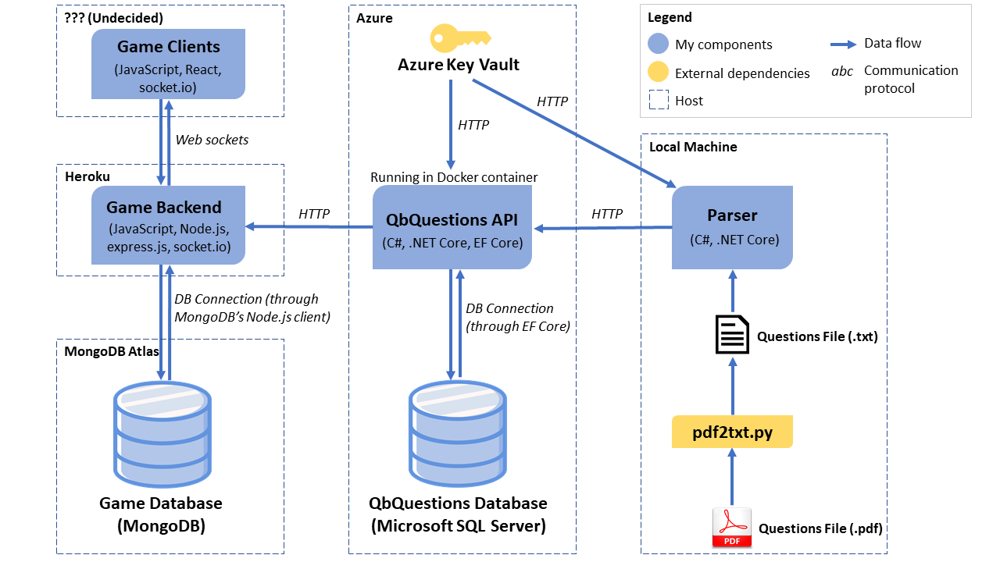

# Extriviaganza

A (big) work in progress.

## Introduction

Extriviaganza is a project inspired by Protobowl, an online quizbowl game that I have enjoyed playing in the past. Credit goes to the creators of Protobowl for the game idea but all source code and design choices here are my own work. The goal is to create a high-performance and reliable application using a new combination of tools and frameworks. This will be the largest personal project I've ever done so I'm excited for the challenges ahead.

## Project Details

There are 5 different components to this project, with 4 already being worked on. More detailed documentation can be found in each component's README. The components are kept in a single repo for organization purposes but most are actually deployable units on their own.

Architecture diagram, updated April 1, 2020:



### Scripts

Questions are obtained from packets found at [the packet archive](http://quizbowlpackets.com/), which are in `.pdf` formats. The first step is to convert `.pdf` files into `.txt` files using a Python command line tool provided by PDFMiner (`pdf2txt.py`). I have created a simple PowerShell script that calls the PDFMiner tool and organizes output files. The other script in the folder is a harness for the console app that parses and loads `.txt` files containing questions into a database.

### [QbPackParser Console App](https://github.com/sherryhli/Extriviaganza/tree/master/QbPackParser)

This C# console app may soon be renamed to `QbPackParserAndDbLoader`, as it functions to parse quizbowl questions into JSON objects like the one below (which represents a single question) and load them into a SQL database using a simple REST API that accepts bulk `POST` requests. As mentioned above, a PowerShell script calls this console app and uses it to parse and load a single `.txt` file or a directory of files.

```
{
    "level": "string",
    "tournament": "string",
    "year": 2019,
    "power": "string",
    "body": "string",
    "answer": "string",
    "notes": "string"
}
```

### [QbQuestions REST API](https://github.com/sherryhli/Extriviaganza/tree/master/QbQuestionsAPI)

This is a .NET Core REST API supporting CRUD operations that interacts with a SQL Server database storing all quizbowl questions to be used in the game. Entity Framework Core is used as the ORM to map models to the database schema. The main purpose of this API is to add questions to the database and to provide questions to the game backend. This API is containerized with Docker and is currently deployed to Azure App Services.

### Game Backend

The game backend is an Express.js server that makes use of socket.io, which allows players to interact in real-time when playing the game. socket.io supports the concept of rooms, which is great because it makes it easy to enable isolation between games. MongoDB is used to store game states.

### Game Frontend

The frontend will likely be done with React.

Updates to this README will be made as I work out more details to this project.